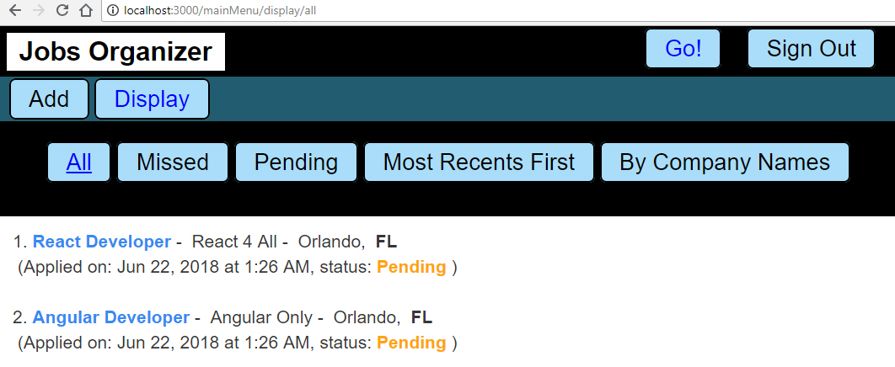
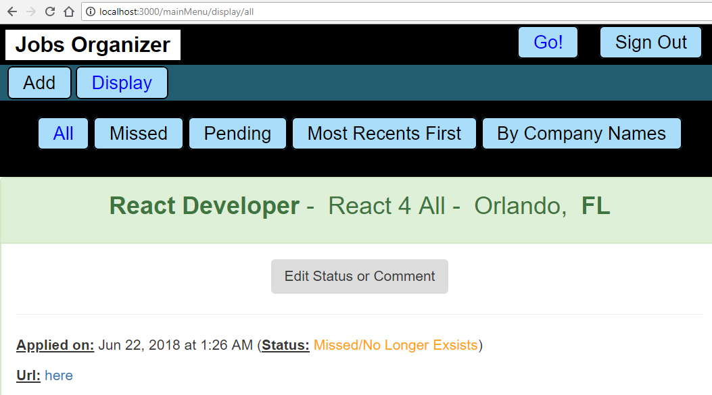

# Job Search Organizer - Service with Authentication at all levels (Front-end, Back-end and Database) - From Scratch...

## Aim

To build an entire application using 3-tier architecture using **React/Redux** as **UI**, **Sequlize** as ORM (**O**bject-**R**elational **M**apping) and **MySQL** to manage the database. Beside the main features, there are **validations** from the **UI** to the **database**.

## Technologies
> * **Security**: **JWT-simple**, **bcrypt-nodejs**, **passport** (**passport-jwt**, **passport-local**)
> * **Front End**: **React-Redux**
> * **Back End**: **Express/Node.js** + **Sequelize** (ORM)
> * **Database**: **mySQL**

## The EER Diagram


## User Interfaces

### Add New Job
As long as all "***Required***" fields are empty, we could not submit the form (**validation**)


### List All Jobs (with Options)


### Show Details of a Specific Job


### To Change the "Status" or "Comment"


## Execution
### You have to create a file "**config.js**" (server/config.js) to contain configuration's parameters that we want to keep secret, for now, we need

```
module.exports = {
    secret: XXXXXXXXXXXXXXXXXX,    
    db_pwd: YYYYYYYYYYYYYYYYYY
};

// "secret" is the "secret" to create the "TOKEN"
// "db_pwd" is the password for your database (that you created) 
```

> The project is build as a 3-tier architecture (fullstack), and the three parts was built to be ready to be put on different machines (which could be in different continents). So, we need to run 3 parts independently, in order: **database**, then **server** then **user interface**.
>
> 1 - You need to create your database with the name '**job_search_organizer**' (enter the password of **YOUR** database).
>
> 2 - Open a terminal, and execute (in the folder "**server**"): **npm install** (to install **dependencies**). Then: **npm run dev** to start the server.
> 
> 3 - Open ANOTHER termimal, and execute (in the folder "**client**"): **npm install** (to install **dependencies**). Then: **npm run start** to start the **user interface**.
>
> 4 - Open your web browser (***Firefox***, ***Chrome***, etc.) then, enter: **localhost:3000**


---------------


## Configuration (VERY IMPORTANT)

At the project's root folder, we have a file name [**index.js**](https://github.com/DinhLeGaulois2/sqlite3_react_redux_job_search/blob/master/server/index.js), by the end, we have:


It's very important to follow the instruction, otherwise, you could have very disappointed surprises ...

---------------

## Author
* Dinh HUYNH - All Rights Reserved!
* dinh.hu19@yahoo.com